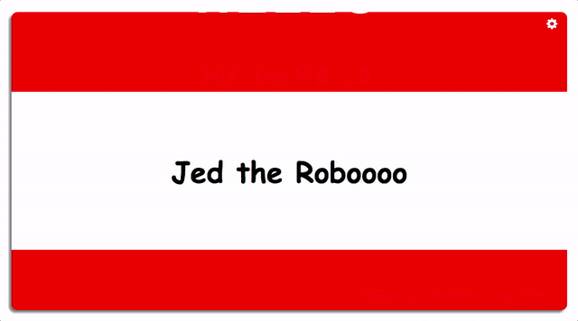

# react-nametag

> A fun React nametag browser toy.

Change the name! Change the colour! As useful as a real nametag, only less so.

## Getting Started

### Installation

You will need to have Node and npm installed to run this app.

Install create-react-app globally:

`npm install -g create-react-app`

Then clone this repo. 

### Running the App

Navigate to the project root and run:

`npm run start`

This will open the app in your browser.

## Technologies Used

react-nametag was made with [create-react-app](https://github.com/facebookincubator/create-react-app) and a few other packages:
- [Animate.css](https://daneden.github.io/animate.css/)
- [React Color](https://casesandberg.github.io/react-color/)
- [Font Awesome](https://fortawesome.github.io/Font-Awesome/)

* * *

>_"That's my name! Unfortunately, you can't wear it out."_
